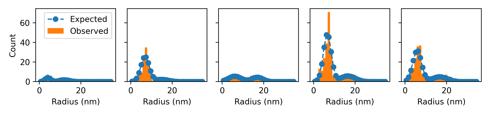

# Predicting Evolution of Voids through Bimodal Distribution

Our TEM experiments indicate voids are typically in two ranges of sizes: between 1-10 nm and a second dstribution of those greater than 10nm.

The count and distribution of these small voids remains constant over time after we reach a 'steady state,' 
and the larger voids continue to grow. 

In the following notebooks, we attempt to model the growth of the voids as a bimodal distribution that changes gradually over time.
